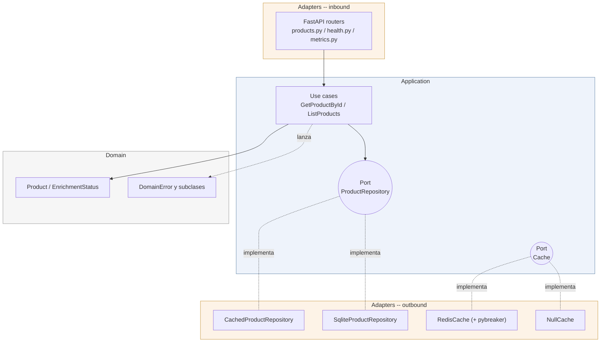
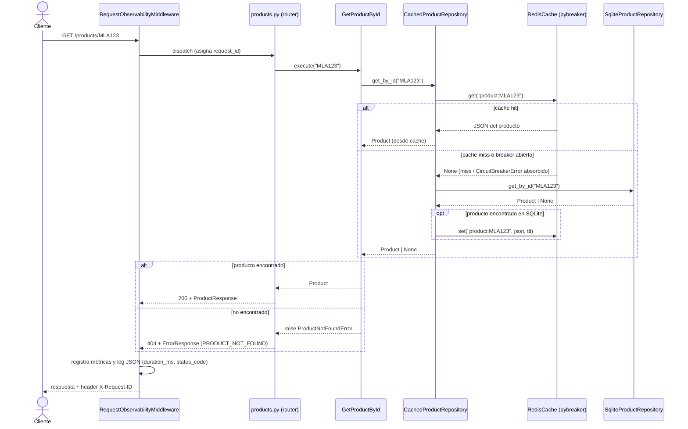
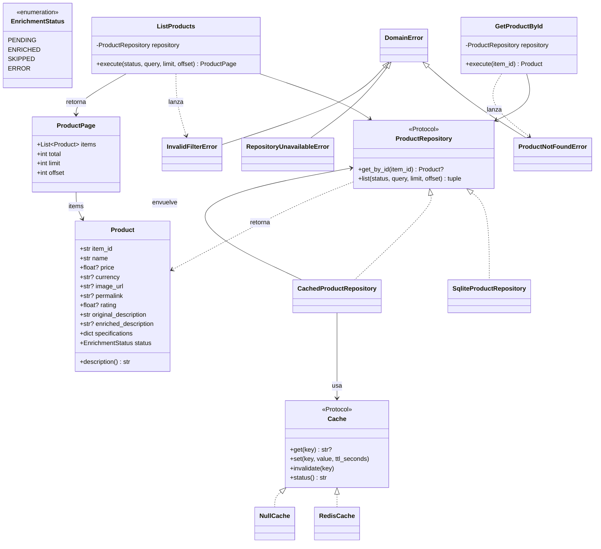

# Arquitectura de la API RESTful — Descripciones Enriquecidas

> Documentación de la arquitectura implementada. Contexto de evaluación: simulación
> del ecosistema de Mercado Libre (250+ equipos, escala de millones de requests),
> aunque el prototipo corra a escala mínima.

## 1. Alcance y decisiones ya acordadas

- La API es **de solo lectura** sobre los datos que ya produjo el pipeline offline
  (`notebooks/meli_enrichment_pipeline.ipynb`): extracción MELI → enriquecimiento Gemini →
  persistencia en SQLite (`meli_products.db`, tabla `products`).
- La API **no llama a MELI ni a Gemini en runtime**. Retries/backoff/circuit breaker para
  esos servicios externos son responsabilidad del pipeline (ya implementados ahí) y se
  documentan como tales, no se reimplementan en la API.
- Los únicos puntos de fallo *de la API* son sus propias dependencias de infraestructura:
  **SQLite** (fuente de verdad) y **Redis** (cache). La estrategia de resiliencia de la API
  gira en torno a estos dos.
- Un producto que no llegó a `status = enriched` (quedó `pending`, `skipped` o `error`)
  igual se sirve: `description` cae a `original_description`, y se expone
  `enrichment_status` para que el consumidor sepa qué está recibiendo.

## 2. Estructura de carpetas

```
meli-data-governance-challenge/
├── docs/
│   ├── Data Governance JD Positions.pdf   # enunciado original (confirmar nombre exacto en el repo)
│   ├── architecture.md                    # este documento
│   └── informe.md                         # informe del desafío: decisiones, resultados, impacto
├── notebooks/
│   └── meli_enrichment_pipeline.ipynb     # pipeline de extracción y enriquecimiento
├── src/
│   └── meli_api/
│       ├── domain/                        # capa 1: núcleo, sin dependencias externas
│       │   ├── product.py                 #   entidad Product, enum EnrichmentStatus
│       │   └── exceptions.py              #   ProductNotFound, RepositoryUnavailable, etc.
│       │
│       ├── application/                   # capa 2: casos de uso + puertos
│       │   ├── ports/
│       │   │   ├── product_repository.py  #   Protocol: get_by_id, list (list ya devuelve el total)
│       │   │   └── cache.py               #   Protocol: get, set, invalidate
│       │   └── use_cases/
│       │       ├── get_product.py         #   GetProductById
│       │       └── list_products.py       #   ListProducts (paginado + filtros)
│       │
│       ├── adapters/                      # capa 3: implementaciones concretas
│       │   ├── inbound/
│       │   │   └── http/
│       │   │       ├── app.py             #   FastAPI app factory
│       │   │       ├── dependencies.py    #   wiring de DI: use cases, repositorio, cache
│       │   │       ├── middleware.py      #   RequestObservabilityMiddleware (request_id, log, métrica por request)
│       │   │       ├── routers/
│       │   │       │   ├── products.py
│       │   │       │   ├── health.py
│       │   │       │   └── metrics.py     #   expone /metrics (Prometheus)
│       │   │       ├── schemas.py         #   Pydantic DTOs (request/response), != domain
│       │   │       ├── error_handlers.py  #   mapea excepciones de dominio -> HTTP status
│       │   │       └── rate_limit.py      #   slowapi config
│       │   └── outbound/
│       │       ├── persistence/
│       │       │   ├── sqlite_repository.py          # implementa ProductRepository (Port)
│       │       │   └── cached_product_repository.py  # decorator cache-aside sobre el repositorio real
│       │       └── cache/
│       │           ├── redis_cache.py         # implementa Cache (Port)
│       │           └── null_cache.py          # no-op, usado si Redis no está configurado
│       │
│       ├── observability/
│       │   ├── logging.py                 #   logging estructurado (JSON)
│       │   └── metrics.py                 #   contadores/histogramas Prometheus
│       │
│       └── config/
│           └── settings.py                #   pydantic-settings (env vars)
│
├── tests/
│   ├── conftest.py       # fixture compartida: SQLite temporal seedeada (seeded_db_path)
│   ├── unit/              # domain, use cases y CachedProductRepository -- puertos con fakes, sin I/O
│   ├── integration/       # sqlite_repository y redis_cache contra instancias reales/temporales
│   └── e2e/               # FastAPI TestClient, stack completo (trae su propio conftest.py)
│
├── pyproject.toml
├── requirements.txt        # dependencias del pipeline (notebook)
├── requirements-api.txt    # dependencias de la API
├── requirements-dev.txt    # dependencias de test (pytest, httpx)
├── Dockerfile
├── docker-compose.yml
├── .dockerignore
├── .gitignore
└── README.md
```

No se listan los `__init__.py` (uno vacío por paquete) ni `src/meli_api.egg-info/` (artefacto que genera `pip install -e .`, no versionado como código propio), para no saturar el árbol con archivos sin contenido relevante.

**Regla de dependencias (hexagonal):** las flechas de dependencia siempre apuntan hacia
adentro. Los adapters (inbound: FastAPI; outbound: SQLite, Redis) dependen de
`application/` a través de los puertos; `application/` depende de `domain/`; `domain/`
no depende de nada. Ver el diagrama de componentes en la sección 11.1 para la versión
gráfica de esta regla.

Consecuencia práctica: para cambiar SQLite por Postgres, se escribe un nuevo
`PostgresProductRepository` que implemente el mismo `Port` — nada en `domain/` ni
`application/` cambia. Igual si mañana el pipeline usa OpenAI en vez de Gemini: eso vive
enteramente fuera de la API (es el pipeline offline), así que ni siquiera toca este
código.

## 3. Puertos (interfaces) — contratos que cruzan la frontera hexagonal

```python
# application/ports/product_repository.py
class ProductRepository(Protocol):
    def get_by_id(self, item_id: str) -> Product | None: ...
    def list(self, status: EnrichmentStatus | None, query: str | None,
              limit: int, offset: int) -> tuple[list[Product], int]: ...

# application/ports/cache.py
class Cache(Protocol):
    def get(self, key: str) -> str | None: ...
    def set(self, key: str, value: str, ttl_seconds: int) -> None: ...
    def invalidate(self, key: str) -> None: ...
```

`Cache` es deliberadamente "tonto" (get/set de strings serializados) para que la
implementación `NullCache` (no-op) sea trivial y el use case nunca necesite saber si
Redis está arriba o no.

## 4. Resiliencia y degradación graceful (dentro de la API)

| Dependencia | Falla como... | Estrategia |
|---|---|---|
| **SQLite** (fuente de verdad) | Archivo lockeado, I/O error, corrupción | No hay fallback razonable: es la única fuente de datos. Se captura la excepción en el adapter, se traduce a `RepositoryUnavailableError` (dominio) y el error handler HTTP devuelve `503` con mensaje descriptivo. Se documenta que en el ecosistema real esto sería una DB gestionada con réplicas, no un archivo local — punto único de falla aceptado explícitamente para el prototipo. |
| **Redis** (cache) | Timeout de conexión, Redis caído | **Nunca debe tumbar la API.** El adapter `redis_cache.py` envuelve cada llamada en try/except sobre errores de conexión; ante fallo, loguea (warning) y se comporta como cache-miss — el use case sigue a SQLite normalmente. Además, un **circuit breaker liviano (pybreaker)** sobre el cliente Redis evita reintentar contra un Redis caído en cada request (lo que sumaría latencia de timeout a *cada* respuesta): tras N fallos consecutivos, el breaker abre y la API deja de intentar Redis por una ventana de cooldown, sirviendo directo desde SQLite hasta que el breaker prueba de nuevo (half-open). |
| **Rate limiter** (si usa Redis como backend compartido) | Redis caído | Se degrada a limitador en memoria del proceso (por instancia, no compartido) en vez de fallar. Documentado como limitación conocida del prototipo (en multi-instancia real, se resolvería en el API Gateway, no en el servicio). |

No hay `tenacity` dentro de la API en este diseño (no hay llamadas de red a reintentar:
SQLite es local y Redis se trata con circuit breaker, no con reintentos — reintentar
contra una cache caída no tiene sentido, solo agrega latencia). El pipeline tampoco usa
`tenacity`: sus dos puntos de reintento (MELI, Gemini) están resueltos con una función
de backoff exponencial escrita a mano (~10 líneas, `_exponential_backoff_seconds` en el
notebook). Se evaluó y se descartó agregar `tenacity` como dependencia para esto: con
una única política simple (exponencial, sin jitter, tope fijo de intentos) repetida en
dos lugares, una librería no reduce código real ni riesgo, solo agrega una dependencia
más al notebook. Quedaría justificada si la política creciera en complejidad (jitter,
reintentos condicionales por tipo de excepción, límites por servicio) — no es el caso
de este alcance. `pybreaker` sí se adopta como dependencia porque un circuit breaker
correcto (con sus tres estados y transiciones) no es razonable de reimplementar a mano
sin introducir el mismo riesgo que se busca evitar.

**Nota sobre validación de `limit`/`offset`:** estos parámetros se validan dos veces —
en el router (`Query(ge=1, le=100)`, `Query(ge=0)`, vía FastAPI/Pydantic) y de nuevo
dentro de `ListProducts.execute` (`InvalidFilterError`). No es duplicación accidental:
la validación en el router es la que efectivamente corta la request con `422` antes de
tocar ningún caso de uso; la del caso de uso protege el invariante del dominio para
cualquier otro llamador presente o futuro (un test, un job batch, otro adapter inbound)
que no pase por el router HTTP y por lo tanto no por Pydantic. Es exactamente lo que
la arquitectura hexagonal pide: el dominio no delega sus propias reglas en un detalle
de un adapter de entrada.

## 5. Cache con Redis — qué se cachea y cómo

- **Patrón:** cache-aside, tanto en `GET /products/{id}` como en `GET /products` (listados).
- **Claves:**
  - `product:{item_id}` → JSON serializado del producto completo.
  - `products:list:{hash(status, query, limit, offset)}` → JSON de la página + total.
- **TTL:** 5 min para detalle, 1 min para listados (los listados cambian más si el
  pipeline corre de nuevo). Configurable por variable de entorno, con estos valores
  como default (ver sección 9, "Decisiones finales").
- **Invalidación:** dado que la API no escribe, no hay invalidación activa por escritura;
  el TTL es el único mecanismo. Si en el futuro el pipeline y la API compartieran proceso,
  se invalidaría `product:{id}` al hacer upsert.
- **Métrica clave:** cache hit ratio (hits / (hits+misses)) por endpoint, expuesta en
  `/metrics`.

## 6. Observabilidad

**Implementado en el prototipo:**
- **Logging estructurado** (JSON a stdout, `observability/logging.py`): un log por
  request (`RequestObservabilityMiddleware`) con `request_id`, método, path (el patrón
  de ruta, ej. `/products/{item_id}`, no la URL concreta -- evita cardinalidad
  explosiva), status y latencia en ms. El access log propio de uvicorn se desactiva
  explícitamente (`logging.getLogger("uvicorn.access")`) porque duplicaría lo mismo en
  texto plano con menos contexto. Nivel WARNING cuando el circuit breaker de Redis
  cambia de estado (`_BreakerStateMetricsListener`) o cuando una operación puntual
  contra Redis falla (tratada como cache-miss, no como error de la API); nivel ERROR
  cuando SQLite no está disponible (`RepositoryUnavailableError`, ver
  `error_handlers.py`), porque ahí sí no hay fallback y la respuesta es un `503`.
- **Métricas Prometheus** (`prometheus-client` + `GET /metrics`, registro propio en
  `observability/metrics.py` para no pisar el registro global default):
  - `http_request_duration_seconds{method,path,status_code}` -- histograma de latencia.
  - `http_request_errors_total{method,path,status_code}` -- contador de respuestas ≥400.
  - `cache_operations_total{operation=detail|list,result=hit|miss}` -- para el cache hit
    ratio (`hit / (hit+miss)`).
  - `circuit_breaker_state{name="redis"}` -- gauge (0=closed, 1=open, 2=half-open),
    actualizado vía listener de `pybreaker` en cada transición de estado.
- **Health check** (`GET /health`): verifica conectividad a SQLite y a Redis por separado,
  devuelve `200` (`status: ok`) si ambos están bien, `200` con `status: degraded` si
  SQLite está OK pero el cache no (Redis caído o `unavailable`), `503` (`status: down`)
  si SQLite falla. `cache: not_configured` cuando el cache está deshabilitado a
  propósito (`MELI_API_CACHE_BACKEND=none`) no cuenta como degradado.

**Documentado pero NO implementado** (se explica en el informe por qué, y qué se haría en
un entorno real tipo MELI):
- **Tracing distribuido** (OpenTelemetry SDK + exporter OTLP a Jaeger/Tempo): con 250+
  equipos y servicios interdependientes, el tracing es lo que permite seguir un request
  a través de límites de equipo. No se implementa por alcance/tiempo del prototipo, pero
  se deja el punto de instrumentación señalado (middleware de FastAPI) para dónde iría.
- **Dashboards** (Grafana) y **alerting** (Alertmanager/PagerDuty) sobre las métricas de
  arriba: umbrales sugeridos (ej. cache hit ratio < 50% en producto de alto tráfico,
  circuit breaker abierto > 5 min, p99 de latencia > Xms).
- **Correlación de logs** vía `request_id` propagado a un colector centralizado
  (CloudWatch/Datadog/ELK) en vez de stdout.

## 7. Diseño pensado para escala (documentado, no todo implementado)

| Decisión | Prototipo | Qué se haría a escala real de MELI |
|---|---|---|
| **Paginación** | `limit`/`offset` (simple, suficiente para SQLite chico) | Paginación por keyset/cursor (`WHERE item_id > last_seen`) — offset no escala en tablas de millones de filas (el `OFFSET N` obliga a escanear N filas). |
| **Rate limiting** | Implementado con `slowapi`, límite por IP, en memoria/proceso | En el gateway/API Manager central de MELI (no en cada servicio), con cuotas por cliente/API-key y `429` estandarizado. |
| **Async I/O** | Endpoints definidos como `def` (síncronos), no `async def`: Starlette los ejecuta automáticamente en un threadpool, así que las llamadas bloqueantes a SQLite no frenan el event loop sin escribir código adicional. No se fuerza `async def` porque no habría nada real que ganar -- el driver de SQLite es síncrono igual, y declarar el endpoint `async` sin un driver async por debajo solo movería el bloqueo al mismo lugar. | Driver async nativo contra una DB real (ej. `asyncpg`), recién ahí declarando los endpoints `async def`; o el patrón CQRS con un read-store optimizado para consultas de alto volumen. |
| **Particionamiento** | No aplica (un archivo SQLite) | Particionar por `site_id` (MLA, MLB, ...) o por categoría, dado el volumen (2M+ productos a nivel MELI); posible sharding horizontal de la DB de lectura. |
| **Horizontal scaling** | Un solo proceso Uvicorn | Múltiples réplicas *stateless* detrás de un load balancer; el estado (cache, rate limit) vive en Redis compartido, no en memoria de proceso — por eso el diseño ya evita estado local en la app. |
| **Auth** | Sin auth (prototipo abierto) | API key u OAuth2 `client_credentials` gestionado centralmente, coherente con que la API sería consumida por "entidades externas" (otros equipos/sistemas de recomendación). |
| **Empaquetado/deploy** | `docker-compose.yml` con dos servicios (`api`, `redis`) para correr localmente sin instalar dependencias en el host -- ver README, sección "Correr con Docker" | Imagen de la API en un registry versionado, desplegada en el orquestador de contenedores de MELI (réplicas, health checks, rollout), con Redis como servicio gestionado en vez de un contenedor local. |

## 8. Endpoints propuestos

| Método | Path | Descripción |
|---|---|---|
| `GET` | `/products` | Listado paginado. Filtros: `status` (enriched/skipped/error/pending), `q` (búsqueda en nombre). Params: `limit`, `offset`. |
| `GET` | `/products/{item_id}` | Detalle de un producto: nombre, `description` (enriquecida o fallback), `enrichment_status`, imagen, precio, moneda, rating, specs, permalink. |
| `GET` | `/health` | Estado de SQLite y Redis por separado. |
| `GET` | `/metrics` | Formato Prometheus (texto plano). |

**Errores:** todas las respuestas de error siguen un formato consistente
(`{"error": {"code": "...", "message": "..."}}`), con status HTTP semánticamente correctos
(`404` producto no encontrado, `422` params de filtro inválidos, `503` SQLite no
disponible, `429` rate limit excedido).

## 9. Decisiones finales (confirmadas)

1. **TTL de cache**: 5 min para detalle (`product:{id}`), 1 min para listados
   (`products:list:*`). Configurable por variable de entorno, con estos valores como
   default.
2. **Circuit breaker de Redis**: abre tras 5 fallos consecutivos, cooldown de 30s antes de
   pasar a half-open. Configurable por variable de entorno, con estos valores como
   default.
3. **Filtros del listado**: `status` (enriched/skipped/error/pending) + `q` (búsqueda en
   nombre). No se agregan filtros adicionales (ej. rango de precio) en esta entrega.
4. **Estructura de carpetas y capas**: confirmada tal como está descripta en este
   documento (secciones 2 y 3).

## 9bis. Nota de implementación: latencia real de Redis caído

Al probar `RedisCache` contra un Redis inalcanzable con un servidor real (no solo
`TestClient`), aparecieron dos comportamientos no obvios que vale la pena dejar
documentados:

1. **`redis-py` reintenta por su cuenta.** Desde la v5, el cliente trae por default
   un `Retry(ExponentialWithJitterBackoff(), retries=10)` para `ConnectionError`/
   `TimeoutError` -- es decir, *cada* llamada (`get`/`set`) podía reintentar hasta 10
   veces internamente antes de devolver el control a nuestro código. Esto duplica
   silenciosamente la política de reintentos que ya habíamos decidido delegar
   enteramente al circuit breaker (sección 4), e inflaba la latencia de una sola
   llamada a varios segundos. Se desactiva explícitamente
   (`retry=Retry(NoBackoff(), retries=0)`) en `redis_cache.py`.
2. **`localhost` resuelve a dos direcciones.** Con Redis caído, resolver
   `localhost` prueba primero `::1` (IPv6) y después `127.0.0.1` (IPv4), así que
   un intento de conexión fallido paga el timeout configurado dos veces. El
   default de `redis_url` usa `127.0.0.1` explícito para evitarlo.

Con ambos ajustes, cada llamada fallida respeta el timeout configurado (~1s por
default) y el circuit breaker abre de forma predecible tras `redis_breaker_fail_max`
fallos consecutivos -- verificado con un servidor `uvicorn` real, no solo con tests.

También vale notar que el patrón cache-aside implica **dos** llamadas al cache por
request en el peor caso (un `get` que falla + un `set` que también falla), por lo
que el breaker abre en menos requests HTTP de las que "fail_max" sugeriría a
primera vista.

## 10. Plan de implementación incremental

Se implementa en partes chicas; cada parte se avisa cuando está lista para revisar, y los
commits los hace el usuario manualmente (no se commitea desde el agente).

1. Estructura base del proyecto + capa de dominio (`domain/`) + puertos (`application/ports/`).
2. Casos de uso (`application/use_cases/`) sobre los puertos, con tests unitarios (ports mockeados).
3. Adapter de persistencia SQLite (`adapters/outbound/persistence/`) + tests de integración.
4. Adapter HTTP (FastAPI): routers, schemas, error handlers, wiring de dependencias.
5. Adapter de cache Redis (cache-aside + circuit breaker) + `NullCache` de fallback.
6. Observabilidad: logging estructurado, métricas Prometheus, `/health`.
7. Rate limiting (slowapi) + revisión final / README de la API.

Rate limiting: `slowapi`, por IP (`get_remote_address`), `MELI_API_RATE_LIMIT_PER_MINUTE`
(default 60/min) aplicado solo a `/products` y `/products/{item_id}` -- `/health` y
`/metrics` quedan exentos a propósito, porque el propio monitoreo necesita poder
consultarlos siempre, incluso bajo carga. Excedido el límite, responde `429` con el
mismo formato de error que el resto de la API (`RATE_LIMIT_EXCEEDED`). Probado con un
servidor `uvicorn` real: el límite corta en la request número `N+1` como se espera, y
`/health`/`/metrics` nunca lo disparan.

## 11. Diagramas UML

Tres diagramas, cada uno respondiendo una pregunta distinta que los puntos 1-9 de este
documento ya responden en prosa; se agregan en Mermaid porque GitHub los renderiza
nativamente en el propio `.md`, sin depender de una imagen externa que se desactualice.

### 11.1 Diagrama de componentes -- capas y dirección de dependencia

Versión diagramada del ASCII de la sección 2: qué depende de qué, y por qué un cambio
de adapter (SQLite -> Postgres, Redis -> Memcached) no toca `domain/` ni `application/`.



`CachedProductRepository` además compone con el puerto `Cache` y envuelve otra
instancia de `ProductRepository` (patrón decorator) -- esa relación no se
dibuja acá para no cruzar flechas entre capas; está representada en el
diagrama de secuencia (11.2) y en el de clases (11.3), que son los que
corresponden para mostrar composición en vez de capas.

### 11.2 Diagrama de secuencia -- `GET /products/{item_id}`

Cubre el camino feliz (cache hit y cache miss) y el caso en que Redis está caído con el
circuit breaker abierto, para dejar visible que ninguno de los dos escenarios de falla
de Redis le impide a la API responder.



### 11.3 Diagrama de clases -- dominio y puertos

El núcleo que no depende de FastAPI, SQLite ni Redis: si mañana cambia cualquiera de
esos tres, este diagrama no cambia.



Ver `README.md` para instalación, variables de entorno y la tabla de endpoints.
